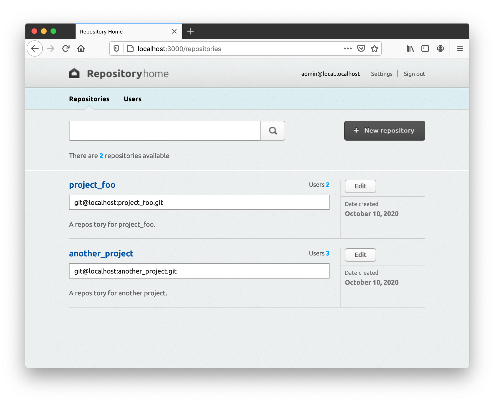

# Repositoryhome

## About

Repositoryhome is a lightweight application for hosting and sharing Git repositories on your own server.

It supports multiple users (which can be administrators or regular users), and 4 levels of permissions per repository per user (None, Read, Read/Write, Full). 



**IMPORTANT:** Although this application appears functional, it is __not under active development__, __nor supported in any way__ by the author. As it is nearly 8 years old by now the libraries it was built upon are outdated and may have __serious security issues__.

THE SOFTWARE IS PROVIDED “AS IS”, WITHOUT WARRANTY OF ANY KIND, EXPRESS OR IMPLIED, INCLUDING BUT NOT LIMITED TO THE WARRANTIES OF MERCHANTABILITY, FITNESS FOR A PARTICULAR PURPOSE AND NONINFRINGEMENT. IN NO EVENT SHALL THE AUTHORS OR COPYRIGHT HOLDERS BE LIABLE FOR ANY CLAIM, DAMAGES OR OTHER LIABILITY, WHETHER IN AN ACTION OF CONTRACT, TORT OR OTHERWISE, ARISING FROM, OUT OF OR IN CONNECTION WITH THE SOFTWARE OR THE USE OR OTHER DEALINGS IN THE SOFTWARE.

## How it Works

Repositoryhome lets you host and share Git repositories on your own server. The functionality is achieved as follows:

- The core of the system is the web app, which is where you can create users and Git repositories, and set user permissions for each Git repository.
- Access to the repositories via Git takes place [over the SSH protocol](https://git-scm.com/book/en/v2/Git-on-the-Server-The-Protocols#_the_ssh_protocol), with access control enforced by a `repositoryhome` script, which is invoked by the SSH server every time a user attempts to access a Git repository via SSH. This script checks the web app's database for the repository permissions associated with the user (via his SSH key) and proceeds accordingly. 


## How to Use

### Settting up a `git` User

As discussed in the previous section the server where Repositoryhome runs must have a user with SSH access enabled, as well as access to the directory where the Git repositories reside. The convention followed is to call this user 'git'. Thus, you could create the user as follows:

```bash
$ sudo adduser git
$ su git
$ cd
$ mkdir .ssh && chmod 700 .ssh
$ touch .ssh/authorized_keys && chmod 600 .ssh/authorized_keys
$ mkdir repositories  # Create the directory where all git repositories will be saved.
```

In addition, you can restrict the git user account to Git-related activities only, with a shell tool called `git-shell`. If you set this as the git user account’s login shell, then that account can’t have normal shell access to the server. To use this, specify git-shell for the git user’s login shell. To do so, you must add the full pathname of the git-shell command to /etc/shells if it’s not already there:

```bash
$ cat /etc/shells      # See if git-shell is already in there.
$ which git-shell      # If not make sure git-shell is installed on your system;
$ sudo -e /etc/shells  # and add the path to git-shell from last command.
```

Now you can edit the shell for a user using `chsh <username> -s <shell>`:

```bash
$ sudo chsh git -s $(which git-shell)
```

After this the git user can still use the SSH connection to push and pull Git repositories but can’t shell onto the server.

You can find a lot more details about setting up Git on the server at [Git on the Server - Setting Up the Server](https://git-scm.com/book/en/v2/Git-on-the-Server-Setting-Up-the-Server).

### Running the App

Repositoryhome is a [Ruby on Rails 3.2](https://guides.rubyonrails.org/v3.2/) app. Below are the basic steps below to run it in development mode.

1. Install Ruby 2.3.3 using a Ruby environment manager like [RVM](https://rvm.io/).
2. In your Ruby environment install [Bundler](https://bundler.io/) 1.2.5: `gem install bundler -v 1.2.5`
3. Run `bundle install` to fetch and install all the project dependencies in your environment.
4. Create a `config/config.yml` file by copying `config/config.yml.example`. In `config/config.yml` enter your own values for `repositories_dir` ('/home/git/repositories' following the example above) and `authorized_keys_file` ('/home/git/repositories/.ssh/authorized_keys' following the example above).
5. Create and set up the database (SQLite) by running: `bundle exec rake db:setup`. This will also create an admin user (username: 'admin@local.localhost', password: 'adminpass').
6. Last, run the app with `rails s`.

## Development

**Important:** This project is not under active development and not supported in any way by the author.

### Running Tests


#### Feature Tests

This project uses [Cucumber](https://cucumber.io/docs/tools/ruby/) for feature tests. To run the feature tests use the following command inside the project directory:

```bash
$ bundle exec rake features
```

#### Unit/Functional Tests
To run the unit/functional tests (using [RSpec](https://rspec.info/)) run the following command inside the project directory:

```bash
$ bundle exec rake spec
```

## License

Repositoryhome is released under the [MIT License](LICENSE).
